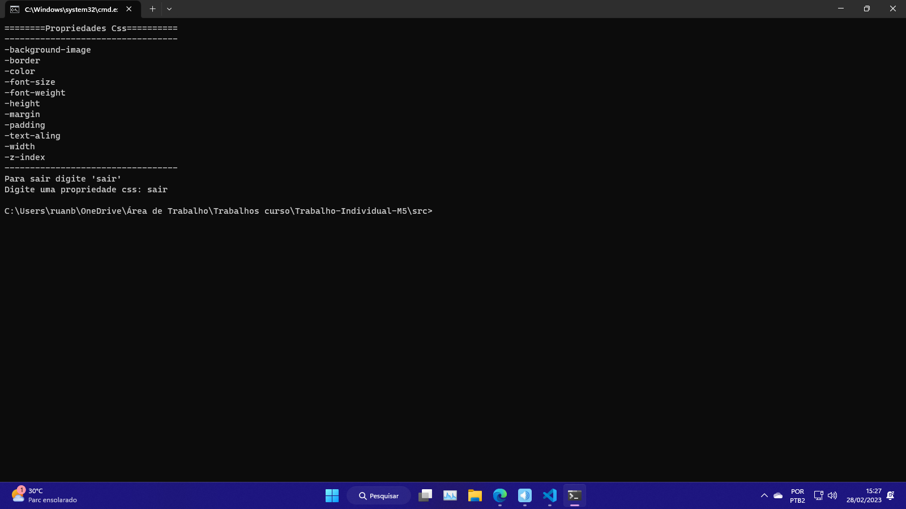

# Trabalho do Modulo 5 :computer: .

## Objetivos?
Montar um programa que consiga rodar no terminal e que possa fazer uma lista de propriedades de css para que o usuario possa adicionar tal propriedade e vela em uma lista em ordem alfabética.

## Linha a linha.
Usando um código simples de laço de repetição com uma condição dentro para validar se o usuário digitar "sair" o programa deverar parar.

## Bibliotecas :books:
Prompt-sync // https://www.npmjs.com/package/prompt-sync

## Execução :airplane:.

  

